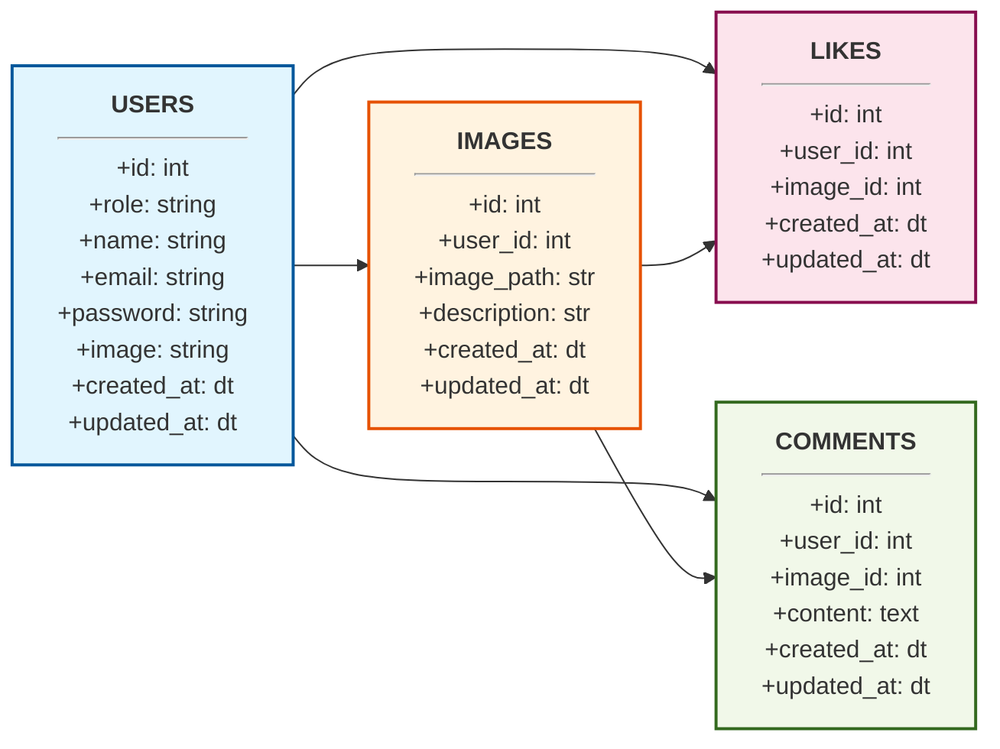

para graficos usar mermaid; y complemento de markdown preview mermaid support

 13. Seccion 85 video 358
    - diseñamos la base de datos

- en DBeaver ejecutamos en la base de datos `DB_laravel`
```sql
-- Tabla de Usuarios, imagenes, comentarios, likes
CREATE TABLE users (
    id              BIGSERIAL PRIMARY KEY,
    role            VARCHAR(20),
    name            VARCHAR(100),
    surname         VARCHAR(200),
    nick            VARCHAR(100),
    email           VARCHAR(255) UNIQUE NOT NULL,
    password        VARCHAR(255) NOT NULL,
    image           VARCHAR(255),
    created_at      TIMESTAMP DEFAULT CURRENT_TIMESTAMP,
    updated_at      TIMESTAMP DEFAULT CURRENT_TIMESTAMP,
    remember_token  VARCHAR(255)
);

CREATE TABLE images (
    id            BIGSERIAL PRIMARY KEY,
    user_id       BIGINT NOT NULL,
    image_path    VARCHAR(255) NOT NULL,
    description   TEXT,
    created_at    TIMESTAMP DEFAULT CURRENT_TIMESTAMP,
    updated_at    TIMESTAMP DEFAULT CURRENT_TIMESTAMP,
    
    CONSTRAINT fk_images_users 
        FOREIGN KEY (user_id) 
        REFERENCES users (id) 
        ON DELETE CASCADE
);

CREATE TABLE comments (
    id          BIGSERIAL PRIMARY KEY,
    user_id     BIGINT NOT NULL,
    image_id    BIGINT NOT NULL,
    content     TEXT NOT NULL,
    created_at  TIMESTAMP DEFAULT CURRENT_TIMESTAMP,
    updated_at  TIMESTAMP DEFAULT CURRENT_TIMESTAMP,

    CONSTRAINT fk_comments_users FOREIGN KEY (user_id) 
        REFERENCES users(id) ON DELETE CASCADE,
    
    CONSTRAINT fk_comments_images FOREIGN KEY (image_id) 
        REFERENCES images(id) ON DELETE CASCADE
);

CREATE TABLE likes (
    id          BIGSERIAL PRIMARY KEY,
    user_id     BIGINT NOT NULL,
    image_id    BIGINT NOT NULL,
    created_at  TIMESTAMP DEFAULT CURRENT_TIMESTAMP,
    updated_at  TIMESTAMP DEFAULT CURRENT_TIMESTAMP,

    CONSTRAINT fk_likes_users FOREIGN KEY (user_id) 
        REFERENCES users(id) ON DELETE CASCADE,
    
    CONSTRAINT fk_likes_images FOREIGN KEY (image_id) 
        REFERENCES images(id) ON DELETE CASCADE
);
```
- conectamos en el archivo .env (ini o mnakefile)
```ini
DB_CONNECTION=pgsql
DB_HOST=127.0.0.1
DB_PORT=5432
DB_DATABASE=DB_laravel
DB_USERNAME=postgres
DB_PASSWORD=root
```

- creamos modelos con artisan
```bash
php artisan make:model Image
php artisan make:model Comment
php artisan make:model Like
```