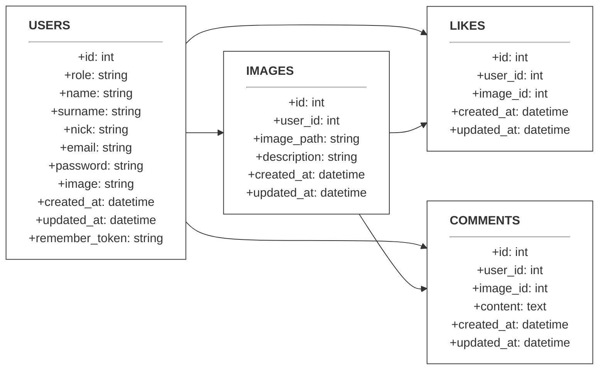
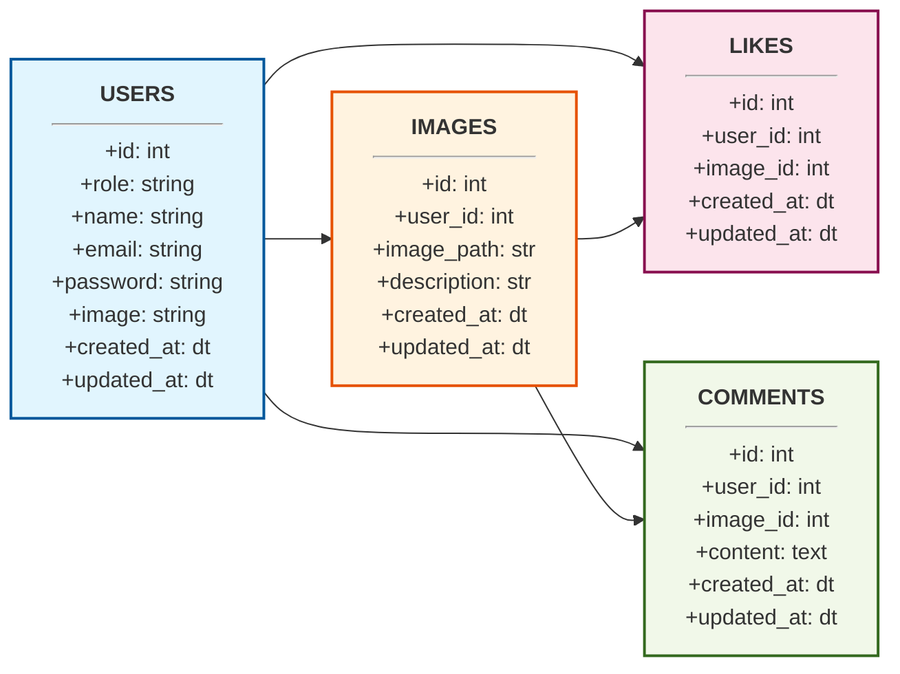

 13. Seccion 85 video 358
    - diseñamos la base de datos

```mermaid
graph LR
    %% Definición de Estilos
    classDef tabla fill:#fff,stroke:#333,stroke-width:1px,text-align:left;

    %% Nodos con toda la información de la imagen
    USERS["<b>USERS</b><hr/>+id: int<br/>+role: string<br/>+name: string<br/>+surname: string<br/>+nick: string<br/>+email: string<br/>+password: string<br/>+image: string<br/>+created_at: datetime<br/>+updated_at: datetime<br/>+remember_token: string"]:::tabla

    IMAGES["<b>IMAGES</b><hr/>+id: int<br/>+user_id: int<br/>+image_path: string<br/>+description: string<br/>+created_at: datetime<br/>+updated_at: datetime"]:::tabla

    LIKES["<b>LIKES</b><hr/>+id: int<br/>+user_id: int<br/>+image_id: int<br/>+created_at: datetime<br/>+updated_at: datetime"]:::tabla

    COMMENTS["<b>COMMENTS</b><hr/>+id: int<br/>+user_id: int<br/>+image_id: int<br/>+content: text<br/>+created_at: datetime<br/>+updated_at: datetime"]:::tabla

    %% Relaciones Horizontales
    USERS --> IMAGES
    USERS --> LIKES
    USERS --> COMMENTS
    IMAGES --> LIKES
    IMAGES --> COMMENTS
```

```mermaid
graph LR
    %% Configuración de Colores y Estilos
    classDef users fill:#e1f5fe,stroke:#01579b,stroke-width:2px;
    classDef images fill:#fff3e0,stroke:#e65100,stroke-width:2px;
    classDef likes fill:#fce4ec,stroke:#880e4f,stroke-width:2px;
    classDef comments fill:#f1f8e9,stroke:#33691e,stroke-width:2px;

    %% Nodos con Info y HTML para Negritas
    U["<b>USERS</b><hr/>+id: int<br/>+role: string<br/>+name: string<br/>+email: string<br/>+password: string<br/>+image: string<br/>+created_at: dt<br/>+updated_at: dt"]:::users

    I["<b>IMAGES</b><hr/>+id: int<br/>+user_id: int<br/>+image_path: str<br/>+description: str<br/>+created_at: dt<br/>+updated_at: dt"]:::images

    L["<b>LIKES</b><hr/>+id: int<br/>+user_id: int<br/>+image_id: int<br/>+created_at: dt<br/>+updated_at: dt"]:::likes

    C["<b>COMMENTS</b><hr/>+id: int<br/>+user_id: int<br/>+image_id: int<br/>+content: text<br/>+created_at: dt<br/>+updated_at: dt"]:::comments

    %% Relaciones
    U --> I
    U --> L
    U --> C
    I --> L
    I --> C
```