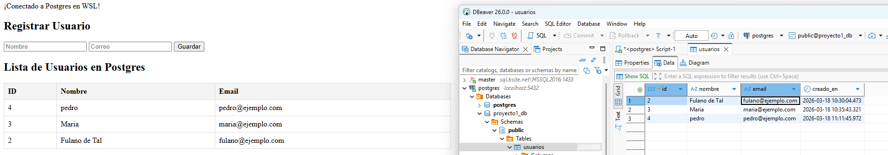

# Ejercicios para afianzar Conocimientos

## Ejercicio 1 - crear archivo
1. en linux `/home/yangpimpollo/Workspace` creamos la carpeta `test1`
2. nos movemos a la carpeta `cd test1` ejecutamos `code .` para abrir visual studio code
3. creamos index.php con un hello world!
4. lanzamos el servidor en la carpeta test1 `php -S localhost:8000`
5. visualizamos en la web `http://localhost:8000` 
6. tambien podemos ejecutar en consola `php index.php` para ver en consola

## Ejercicio 2 - conectar con postgresql
1. activamos la BD desde la consola `sudo service postgresql start`
2. se puede verificar si esta activo `sudo service postgresql status`
3. en index.php colocamos

```php
<?php
    $host = "localhost";
    $db = "proyecto1_db";
    $user = "postgres";
    $pass = "root";

    try {
        $dsn = "pgsql:host=$host;port=5432;dbname=$db;";
        $pdo = new PDO($dsn, $user, $pass, [PDO::ATTR_ERRMODE => PDO::ERRMODE_EXCEPTION]);
        echo "¡Conectado a Postgres en WSL!";
    } catch (PDOException $e) {
        echo $e->getMessage();
    }
?>
```
4. creamos la tabla con un SQLscript en BDeaver si no tenemos y insertamos un valor
```sql
    CREATE TABLE usuarios (
        id INT AUTO_INCREMENT PRIMARY KEY,
        nombre VARCHAR(100) NOT NULL,
        email VARCHAR(150) NOT NULL UNIQUE
    );

    INSERT INTO usuarios (nombre, email) 
    VALUES ('Fulano de Tal', 'fulano@ejemplo.com');
```

5. usemos php para introducir datos dentro de try despues de la conección colocamos
```php
// Insertar un usuario
    $sql = "INSERT INTO usuarios (nombre, email) VALUES (:nom, :em)";
    $stmt = $pdo->prepare($sql);
    $stmt->execute([
        ':nom' => 'Maria',
        ':em'  => 'maria@ejemplo.com'
    ]);

    echo "¡Usuario insertado con éxito!";
```
| id |      nombre    |         email         |
|----|:--------------:|:---------------------:|
|  1 |  Fulano de Tal |  'fulano@ejemplo.com' |
|  2 |     Maria      |   'maria@ejemplo.com' |

6. ahora para hacer un crud mas dinamico remplazamos el codigo anterior por
```php
    // 2. Lógica para INSERTAR si se envió el formulario
    if ($_SERVER['REQUEST_METHOD'] === 'POST' && !empty($_POST['nombre'])) {
        $sql = "INSERT INTO usuarios (nombre, email) VALUES (:nom, :em)";
        $stmt = $pdo->prepare($sqlInsert);
        $stmt->execute([
            ':nom' => $_POST['nombre'],
            ':em'  => $_POST['email']
        ]);
        header("Location: index.php"); // Recargar para limpiar el formulario
    }

    // 3. Lógica para LEER (Select)
    $usuarios = $pdo->query("SELECT * FROM usuarios ORDER BY id DESC")->fetchAll(PDO::FETCH_ASSOC);
```

```html
<!DOCTYPE html>
<html lang="es">
<head>
    <meta charset="UTF-8">
    <title>Mi App con Postgres</title>
    <style>
        table { width: 50%; border-collapse: collapse; margin-top: 20px; }
        th, td { border: 1px solid #ddd; padding: 8px; text-align: left; }
        th { background-color: #f4f4f4; }
    </style>
</head>
<body>

    <h2>Registrar Usuario</h2>
    <form method="POST">
        <input type="text" name="nombre" placeholder="Nombre" required>
        <input type="email" name="email" placeholder="Correo" required>
        <button type="submit">Guardar</button>
    </form>

    <h2>Lista de Usuarios en Postgres</h2>
    <table>
        <tr>
            <th>ID</th>
            <th>Nombre</th>
            <th>Email</th>
        </tr>
        <?php foreach ($usuarios as $u): ?>
        <tr>
            <td><?= $u['id'] ?></td>
            <td><?= htmlspecialchars($u['nombre']) ?></td>
            <td><?= htmlspecialchars($u['email']) ?></td>
        </tr>
        <?php endforeach; ?>
    </table>

</body>
</html>
```



7. para el login remplazamos el codigo anterior por

```php
    if ($_SERVER['REQUEST_METHOD'] === 'POST') {
        $username = $_POST['username'];
        $password = $_POST['password'];

        // Buscamos al usuario por su nombre
        $stmt = $pdo->prepare("SELECT * FROM users WHERE name = ?");
        $stmt->execute([$username]);
        $user = $stmt->fetch();

        // Verificamos si existe y si la contraseña coincide
        // NOTA: Si usas password_hash para registrar, aquí usarías password_verify()
        if ($user && $password === $user['pass']) {
            $_SESSION['user_id'] = $user['id'];
            $_SESSION['user_name'] = $user['name'];
            
            echo "¡Bienvenido, " . htmlspecialchars($user['name']) . "!";
            // header("Location: dashboard.php"); // Redirigir a una página privada
        } else {
            echo "Usuario o contraseña incorrectos.";
        }
    }
```

```html
<!DOCTYPE html>
<html>
<head>
    <title>Login PHP</title>
</head>
<body>
    <h2>Iniciar Sesión</h2>
    <form action="" method="POST">
        <input type="text" name="username" placeholder="Usuario" required><br><br>
        <input type="password" name="password" placeholder="Contraseña" required><br><br>
        <button type="submit">Entrar</button>
    </form>
</body>
</html>
```
