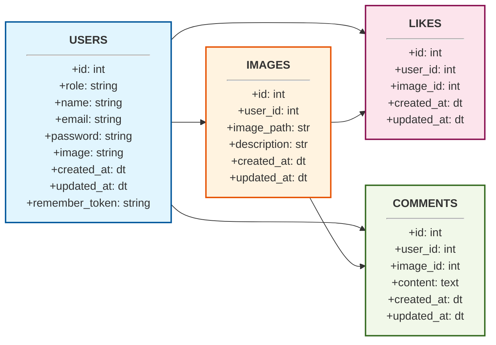

# [ secciones 84 - 93 ] Proyecto de tutorial clonando instagram

* [ sec 84 ] intro (353)
* [ sec 85 ] BD y entidades (354 - 361)
* [ sec 86 ] login y registro (362-364)
* [ sec 87 ] configuracion de usuario (365-372) 
* [ sec 88 ] imagenes (373-381)
* [ sec 89 ] comentarios (382-388)
* [ sec 90 ] likes (389-397) 
* [ sec 91 ] perfiles (398-400)
* [ sec 92 ] edicion y borrado de imagenes (401-405)
* [ sec 93 ] buscador (406-408) 

## [sec 85] creando proyecto
### video 354-361
ejecutar los siguientes comandos en `Workspace` para crear el proyecto
```bash
yangpimpollo@PC-VONEX-086:~$ ls
Desktop  Documents  Downloads  Music  Pictures  Videos  Workspace  carpeta1
yangpimpollo@PC-VONEX-086:~$ cd W*
yangpimpollo@PC-VONEX-086:~/Workspace$ ls
_holocron  basura  ejemplo1_laravel  ejemplo2_laravel
yangpimpollo@PC-VONEX-086:~/Workspace$ laravel new proyecto_tutorial

 ██╗       █████╗  ██████╗   █████╗  ██╗   ██╗ ███████╗ ██╗
 ██║      ██╔══██╗ ██╔══██╗ ██╔══██╗ ██║   ██║ ██╔════╝ ██║
 ██║      ███████║ ██████╔╝ ███████║ ██║   ██║ █████╗   ██║
 ██║      ██╔══██║ ██╔══██╗ ██╔══██║ ╚██╗ ██╔╝ ██╔══╝   ██║
 ███████╗ ██║  ██║ ██║  ██║ ██║  ██║  ╚████╔╝  ███████╗ ███████╗
 ╚══════╝ ╚═╝  ╚═╝ ╚═╝  ╚═╝ ╚═╝  ╚═╝   ╚═══╝   ╚══════╝ ╚══════╝

   WARN  A new version of the Laravel installer is available. You have version 5.24.10 installed, the latest version is 5.25.2.

 ┌ Would you like to update now? ───────────────────────────────┐
 │ No                                                           │
 └──────────────────────────────────────────────────────────────┘

 ┌ Which starter kit would you like to install? ────────────────┐
 │ None                                                         │
 └──────────────────────────────────────────────────────────────┘

 ┌ Which testing framework do you prefer? ──────────────────────┐
 │ PHPUnit                                                      │
 └──────────────────────────────────────────────────────────────┘

 ┌ Do you want to install Laravel Boost to improve AI assisted coding? ┐
 │ No                                                                  │
 └─────────────────────────────────────────────────────────────────────┘

   INFO  Application key set successfully.

 ┌ Which database will your application use? ───────────────────┐
 │ PostgreSQL                                                   │
 └──────────────────────────────────────────────────────────────┘

 ┌ Default database updated. Would you like to run the default database migrations? ┐
 │ No                                                                               │
 └──────────────────────────────────────────────────────────────────────────────────┘

 ┌ Would you like to run npm install and npm run build? ────────┐
 │ Yes                                                          │
 └──────────────────────────────────────────────────────────────┘

  New to Laravel? Check out our documentation. Build something amazing!

yangpimpollo@PC-VONEX-086:~/Workspace$ cd p*
yangpimpollo@PC-VONEX-086:~/Workspace/proyecto_tutorial$ code .
```
configuramos la base de datos
```ini
DB_CONNECTION=pgsql
DB_HOST=127.0.0.1
DB_PORT=5432
DB_DATABASE=proyecto_tutorial
DB_USERNAME=postgres
DB_PASSWORD=root
```
0. diseñamos la base de datos


1. creamos los siguientes modelos Image, Comment, Like en su propia clase de modelo añadimos sus relaciones `hasMany` o `belongsTo`
2. creamos nueva migracion y con `DB::statement` insertamos script sql para crear 4 tablas users, likes, images, comments y migramos             
*ojo :* que comentamos las tablas que venian por defecto para no subirlas ecepto `secciones`
3. creamos un seeder para rellenar datos de prueba y editamos la funcion run() y llenamos las tablas

```bash
php artisan make:model Image
php artisan make:model Comment
php artisan make:model Like

php artisan make:migration crear_cuatro_tablas
php artisan migrate

php artisan make:seeder TestSeed
php artisan db:seed --class=TestSeed
```

probamos la ORM
```php
<?php

use Illuminate\Support\Facades\Route;
use App\Models\Image;


Route::get('/', function () {

    $images = Image::all();
    foreach ($images as $image) {
        echo $image->image_path."</br>";
        echo $image->description."</br>"; 
        echo $image->user->name." ".$image->user->surname."</br>";

        if (count($image->comments) >= 1) {
            echo '<h4>Comments</h4>';
            foreach ($image->comments as $comment) {
                echo $comment->user->name.' '.$comment->user->surname.': ';
                echo $comment->content.'<br/>';
            }
        }
        echo 'LIKES: '.count($image->likes);
        echo "<hr/>";

    }
    die();
    return view('welcome');
});
```

## [sec 86] login y registro 
### video 362-364
ese comando fue eliminado de laravel 😭
```bash
yangpimpollo@PC-VONEX-086:~/Workspace/proyecto_tutorial$ php artisan make:auth

   ERROR  Command "make:auth" is not defined. Did you mean one of these?  
```
